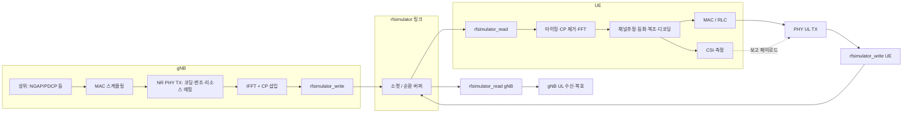

# OAI rfsimulator: gNB↔UE 데이터 플로우, Sionna 임베딩, FIR 전환 방향

지금까지 코드·설계 검토로 정리한 내용을 한 문서로 묶는다. (다운링크 중심으로 상세히 서술하고, **UE→gNB 보고**는 UL·상위 시그널링 관점에서 연결한다.)

---

## 1. rfsimulator 사용 시 데이터 플로우 (비트 → UE FFT → gNB 보고)

### 1.1 전체 개요 (DL 한 슬롯 흐름)

아래는 **gNB가 사용자/제어 데이터를 송신하고 UE가 수신·복호한 뒤 측정·보고를 올리는** end-to-end 개념이다. 물리적으로는 **gNB 프로세스**와 **UE 프로세스**가 각각 `openair0_device`(rfsimulator)의 **쓰기/읽기**를 통해 TCP로 IQ를 주고받는다.
cd /home/lab/바탕화면/Project_embedding/openairinterface5g && export LD_LIBRARY_PATH=/home/lab/바탕화면/Project_embedding/openairinterface5g/cmake_targets/ran_build/build:$LD_LIBRARY_PATH && OAI_SIONNA_RFSIM_APPLY=1 OAI_SIONNA_CHANNEL_FAMILY=TDL OAI_SIONNA_TDL_MODEL=A OAI_SIONNA_DELAY_SPREAD_S=100e-9 OAI_SIONNA_MIN_SPEED_MPS=0 OAI_SIONNA_MAX_SPEED_MPS=15 OAI_SIONNA_CARRIER_HZ=3619200000 OAI_SIONNA_SAMPLING_HZ=61440000 OAI_SIONNA_RX_ANT=4 OAI_SIONNA_TX_ANT=4 OAI_SIONNA_DIAG_ONLY=1 OAI_SIONNA_SCALE=1.0 OAI_SIONNA_UPDATE_US=5000000 /home/lab/바탕화면/Project_embedding/openairinterface5g/cmake_targets/ran_build/build/nr-uesoftmodem --rfsim --noS1 --rfsimulator.serveraddr 127.0.0.1 --ue-nb-ant-rx 4 --ue-nb-ant-tx 4 -C 3619200000 -r 106 --numerology 1 --band 78 --ssb 516 2>&1 | ts '[%Y-%m-%d %H:%M:%.S]' | tee ue_4x4_embed_ueonly_sionna_doppler.log

- **DL**: gNB `rfsimulator_write` → 네트워크 → UE `rfsimulator_read` → `rxdata` 축적 → `slot_fep` 등에서 **FFT**.
- **UL(보고 포함)**: UE가 PUCCH/PUSCH 등으로 **CSI/ACK/NACK/RRC**를 올리면 동일 rfsim 링크의 **반대 방향**으로 IQ가 흐르고, gNB 쪽 `rfsimulator_read` → UL PHY → MAC/RLC로 전달된다.

### 1.2 gNB: 비트/PDU에서 시간영역 IQ까지

1. **상위 계층**  
   코어/스택에서 내려온 SDU, RRC 설정, DRB/QoS 등이 **MAC**에 전달된다.

2. **MAC**  
   슬롯 단위로 DCI/PDSCH/PDCCH 등 **할당**을 결정하고 PHY에 **전송할 TB·DCI·제어 정보**를 넘긴다.

3. **NR PHY 송신**  
   CRC 부착, LDPC/Polar 등 **채널 코딩**, 스크램블, **변조(QAM 등)**, 레이어 매핑, **리소스 그리드(RE에 심볼 배치)** 까지 수행한다. (세부는 CHBWP·slot 처리 함수 체인에 따름.)

4. **OFDM 변조 (시간영역)**  
   안테나별로 주파수 영역 그리드 `X[k]`에 대해 **IFFT(`idft`)** 를 수행하고 **CP(순환 프리픽스)** 를 붙인다.  
   근거: `openair1/PHY/MODULATION/ofdm_mod.c`의 `PHY_ofdm_mod()` — `idft()` 후 CP `memcpy`.

5. **RF 디바이스 출력**  
   생성된 **시간영역 IQ 샘플**이 `txdata` 계열 버퍼에 쌓이고, rfsimulator 드라이버의 **쓰기 경로**를 통해 **소켓**으로 상대 프로세스(UE)에 전달된다.

### 1.3 rfsimulator: 링크 계층 (IQ 스트림)

- **송신측**: PHY가 만든 샘플 블록이 **헤더(안테나 수·타임스탬프 등)** 와 함께 전송된다.
- **수신측**: 소켓에서 읽어 **연결별 순환 버퍼 `circularBuf`** 에 적재한다.
- **채널 처리(아래 2절·3절과 연결)**  
  - `chanmod` **OFF**: `ptr->channel_model == NULL` → 레거시 실수 믹싱 및/또는 **Sionna 평탄 H**(`OAI_PYTHON_EMBED`).  
  - `chanmod` **ON**: `rxAddInput()` — **FIR 탭과 이산 선형 컨볼루션** + 경로손실·잡음·(옵션) 도플러.

출력은 호출자가 넘긴 **`samplesVoid` / `rxdata`** 버퍼에 채워지고, **`trx_read_func` 반환**으로 PHY 스레드에 돌아간다.  
근거: `radio/rfsimulator/simulator.c`의 `rfsimulator_read()`, `radio/rfsimulator/apply_channelmod.c`의 `rxAddInput()`.

### 1.4 UE: `rfsimulator_read` 이후 ~ FFT ~ 상위 계층

1. **샘플 수집**  
   `nr-ue.c` 등에서 `UE->rfdevice.trx_read_func()` → **`UE->common_vars.rxdata`** 에 시간영역 IQ가 누적된다.

2. **동기·타이밍**  
   PSS/SSS, SSB 등으로 **프레임/슬롯 정렬** 후, OFDM 심볼 경계에 맞게 **CP를 건너뛴 구간**을 선택한다.

3. **FFT (`dft`)**  
   `openair1/PHY/MODULATION/slot_fep.c`의 `front_end_fft()` 등에서 **CP 제거 위치를 반영한 `rx_offset`** 으로부터 `dft()`를 호출해 **`rxdataF`** (주파수 영역)를 만든다.

4. **수신 PHY 후속**  
   채널 추정(필요 시 DMRS), **등화**, PDSCH/PDCCH **복조·디코딩**, CRC 확인 후 **MAC/RLC/PDCP**로 SDU 전달.

5. **gNB로의 “보고”**  
   - **PHY 측정**(RSRP/RSRQ/SINR 등)과 **CSI**(CQI/PMI/RI 등)는 상위 규격에 따라 **PUCCH/PUSCH** 등 **UL 채널**로 멀티플렉싱된다.  
   - 즉 **동일 rfsimulator 링크의 UL 방향**으로 IQ가 다시 흐르고, gNB의 `rfsimulator_read` → UL PHY → 스케줄러/RRC가 **보고를 해석**한다.  
   - **RRC/NAS** 메시지도 결국 TB로 인코딩되어 같은 UL 경로를 탄다.

---

## 2. `oai_channel_embed.py` 임베딩 시 데이터 플로우 변화

### 2.1 빌드·실행 전제

- **`-DOAI_PYTHON_EMBED=ON`** 빌드.
- 환경변수 **`OAI_SIONNA_RFSIM_APPLY=1`** 로 “평탄 H 적용” 경로 활성화.  
  상세는 `doc/SIONNA_EMBED_RFSIM.md` 참고.

### 2.2 무엇이 바뀌는가

| 단계 | 임베딩 없음 (`chanmod` OFF, Sionna OFF) | 임베딩 ON (`OAI_SIONNA_RFSIM_APPLY=1`, `chanmod` OFF) |
|------|----------------------------------------|------------------------------------------------------|
| **H 생성** | 없음 | 백그라운드 스레드가 `oai_channel_embed` 모듈에서 `get_h_flat()` 등 호출 → `sionna_h_flat` 갱신. (`OAI_SIONNA_SHARED_FILE` 모드면 파일에서 H 스냅샷 로드.) |
| **rfsimulator_read** | `circularBuf` → 레거시 **실수 계수 믹싱** (+ 선택 AWGN) | 동일 분기 안에서 **복소 행렬**: \(y_r \mathrel{+}= H_{r,t} \cdot x_t\) (스케일·`diag_only` 등). |
| **IQ의 출처** | 여전히 상대 PHY의 **IFFT+CP 출력** | 동일 (임베딩은 **채널 가중**만 추가). |
| **UE FFT 이후** | 동일 파이프라인 | 동일; 다만 수신 신호에 **주파수 평탄 MIMO 결합**이 반영된 상태. |

### 2.3 바뀌지 않는 것

- gNB **IFFT/CP**, UE **CP 제거/FFT**, MAC/RLC/RRC **논리 구조**는 그대로다.
- **`chanmod` ON** 이면 `ptr->channel_model != NULL` 이 되어 **`rxAddInput` FIR 경로**로 가므로, **현재 구조에서는 Sionna 평탄 H 분기와 동시에 타기 어렵다** (배타적 설계).

### 2.4 구현 근거 코드 위치

- H 적용: `radio/rfsimulator/simulator.c` — `rfsimulator_read()` 내 `else { // no channel modeling }`, `#ifdef OAI_PYTHON_EMBED` 블록 (`sionna_apply`, `sionna_h_flat`).
- H 생성: `sionna-main/oai_channel_embed.py` — `get_h_flat()`, `init()`.

---

## 3. 평탄 H → 이산 선형 컨볼루션(FIR)로 바꾸려면 (코드 구조)

### 3.1 현재 상태

- **평탄 H**: 샘플 인덱스 \(n\)마다 \(y[n] = H\,x[n]\) (지연 탭 없음).
- **FIR (`chanmod`)**: \(y_r[n] = \sum_t \sum_\ell h_{r,t}[\ell]\, x_t[n-\ell]\) — `rxAddInput()` + `channelDesc->ch`.

`get_h_flat()` 직전의 Sionna 출력은 **경로별 \(a_p\), \(\tau_p\)** 이고, 평탄 H는 이를 **캐리어 위상으로 접어 한 복소수/행렬**로 만든 것이다.

### 3.2 목표

다경로 정보를 **샘플레이트 \(f_s\)** 에 맞춘 **FIR 탭**으로 바꾸고, **`rxAddInput`이 이미 수행하는 컨볼루션**에 탑재한다. (Python에서 “IQ를 컨볼루션 입력으로 넣는다”기보다, **탭 \(h[\ell]\)을 `channel_desc_t`에 채운다**가 정확하다.)

### 3.3 권장 구조 변경 (단계)

1. **데이터 규약 정의**  
   - 파일 또는 공유 메모리: `(rx, tx, ℓ)` 또는 flatten된 `h` 실수부·허수부, `channel_length`, `seq`, `fs` 일치 여부.  
   - Python: `get_h_flat()`와 별도로 **`get_fir_taps_flat()`** 또는 `a,tau → numpy taps` 유틸 추가.

2. **양자화**  
   - \(\tau_p \cdot f_s\) 를 정수 탭 인덱스로 반올림(또는 분수 지연 시 인접 탭 분할).  
   - MIMO: 각 \((r,t)\) 마다 길이 \(L\) 벡터.

3. **C 측 주입 지점**  
   - **옵션 A**: `chanmod` ON 유지, `load_channellist` 이후 생성된 `channel_desc_t`의 **`ch` 포인터들이 가리키는 메모리**를 주기적으로 **외부 탭으로 `memcpy`** (mutex 보호).  
   - **옵션 B**: `simulator.c`에서 `random_channel()` 대신 또는 후속으로 **“외부 FIR 모드”** 플래그 시 탭만 갱신.  
   - **옵션 C**: 새 `channelmod` `type` 문자열 추가 → `new_channel_desc_scm` 분기에서 탭을 0으로 두고 **첫 read 전 전부 외부에서 채움** (초기화 순서 주의).

4. **실행 설정**  
   - **`OAI_SIONNA_RFSIM_APPLY=0`** (평탄 H 끔).  
   - **`--rfsimulator.options chanmod`** 및 **`channelmod`** conf에 **모델 이름·안테나 수** 일치.  
   - `load_channellist(tx_num_channels, rx_num_channels, ...)` 가 **4×4 등 MIMO FIR** 을 이미 지원함 — `rxAddInput`은 `nb_tx`·`nb_rx` 루프로 일반화되어 있음.

5. **검증**  
   - 동일 \(f_s\)에서 OAI 네이티브 **TDL-A conf** 와 외부 탭의 **PDP/에너지** 비교.  
   - 평탄 H 실험과 **교차 비활성화** 후 BER/CSI 변화 관측.

### 3.4 리스크·주의

- **CP 길이 vs 채널 길이**: 탭이 길면 ISI 증가.  
- **1×1 빠른 경로**: `nbAnt_tx == 1 && nb_cnx == 1` 이면 **복사만** 하는 분기가 있어, MIMO FIR 실험 시 조건 확인.  
- **도플러**: OAI `rxAddInput`의 위상 항과 Python 측 시변 탭 **이중 적용** 방지.  
- 상세 6하 계획: `doc/SIONNA_MULTIPATH_TO_OAI_FIR_6W1H.md`.

---

## 참고 문서·코드

| 내용 | 위치 |
|------|------|
| APPLY=0 플로우·`chanmod` 수식 | `doc/OAI_APPLY0_GNB_UE_LINK_DATAFLOW.md` |
| Sionna 임베딩 빌드·환경변수 | `doc/SIONNA_EMBED_RFSIM.md` |
| 평탄 H vs FIR 경로 구분 | `doc/SIONNA_RFSIM_CONCEPT_AND_PATHS.md` |
| FIR 컨볼루션 루프 | `radio/rfsimulator/apply_channelmod.c` — `rxAddInput()` |
| 평탄 H 루프 | `radio/rfsimulator/simulator.c` — `rfsimulator_read()` |
| TDL-A~E 탭 파라미터(표) | `openair1/SIMULATION/TOOLS/random_channel.c` — `tdl_a_delays` 등 |
| UE FFT | `openair1/PHY/MODULATION/slot_fep.c` — `front_end_fft()` / `dft()` |
| gNB IFFT | `openair1/PHY/MODULATION/ofdm_mod.c` — `PHY_ofdm_mod()` |

---

*이 문서는 대화 및 코드 리딩 기준으로 정리되었으며, 브랜치·커밋에 따라 함수명·옵션은 약간 다를 수 있다.*
